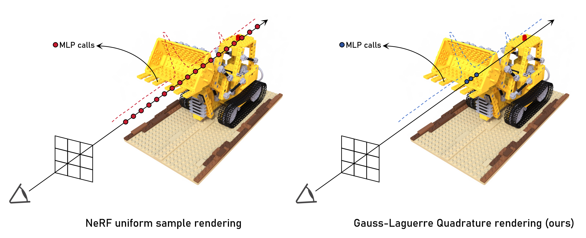

# GL-NeRF
<p align="center"></p>

This repository hosts the code for the paper:

[GL-NeRF: Gauss-Laguerre Quadrature Enables Training-Free NeRF Acceleration (NeurIPS 2024)](https://arxiv.org/pdf/2410.19831)

by [Silong Yong](https://silongyong.github.io/), [Yaqi Xie](https://yaqi-xie.me/), [Simon Stepputtis](https://simonstepputtis.com/), [Katia Sycara](http://www.cs.cmu.edu/~sycara/)

[arXiv](https://arxiv.org/abs/2410.19831) | [Project page](https://silongyong.github.io/GL-NeRF_project_page/)

## News
- 03/28/2025: Initial release for GL-NeRF code!

## Abstract

Volume rendering in neural radiance fields is inherently time-consuming due to the large number of MLP calls on the points sampled per ray. Previous works would address this issue by introducing new neural networks or data structures. In this work, We propose GL-NeRF, a new perspective of computing volume rendering with the Gauss-Laguerre quadrature. GL-NeRF significantly reduces the number of MLP calls needed for volume rendering, introducing no additional data structures or neural networks. The simple formulation makes adopting GL-NeRF in any NeRF model possible. In the paper, we first justify the use of the Gauss-Laguerre quadrature and then demonstrate this plug-and-play attribute by implementing it in two different NeRF models. We show that with a minimal drop in performance, GL-NeRF can significantly reduce the number of MLP calls, showing the potential to speed up any NeRF model.

## Installation

Please refer to each model for their specific installation.

The code has been tested with Python 3.8.18, PyTorch 1.13.1 and CUDA 12.7 on Ubuntu 24.04


## Running

For each model, please refer to [Vanilla_NeRF](./Vanilla_NeRF/README.md), [TensoRF](./TensoRF/README.md), [InstantNGP](./InstantNGP/README.md) for details on how to train the model and run inferences with the Gauss-Laguerre quadrature.

## Misc

Please change to the corresponding directory when running experiments with the models. For example, to experiment with Vanilla NeRF
```shell
cd Vanilla_NeRF
```

## TODO

- [ ] Release TensoRF implementation
- [ ] Release InstantNGP implementation

## License

- Code: [Apache](./LICENSE)

## Citation
If you find our work helpful for your research. Please consider citing our paper.
```bibtex
@article{yong2024gl,
  title={Gl-nerf: Gauss-laguerre quadrature enables training-free nerf acceleration},
  author={Yong, Silong and Xie, Yaqi and Stepputtis, Simon and Sycara, Katia},
  journal={Advances in Neural Information Processing Systems},
  volume={37},
  pages={120418--120442},
  year={2024}
}
```